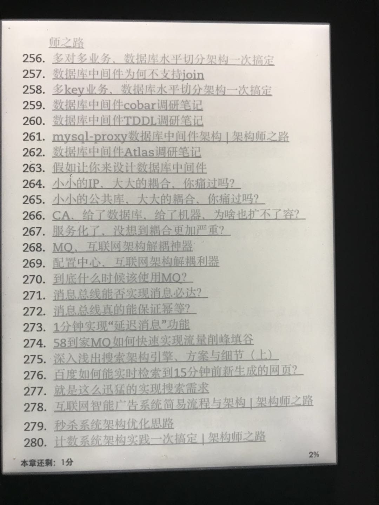
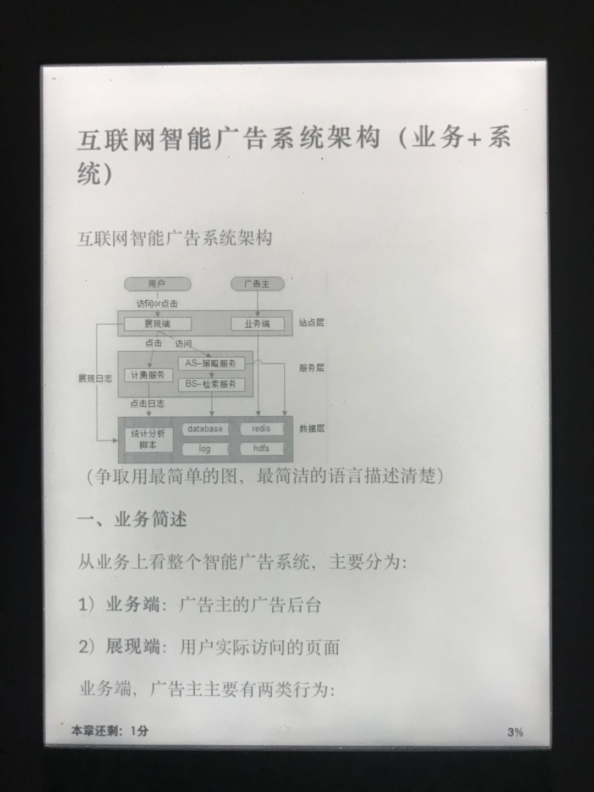
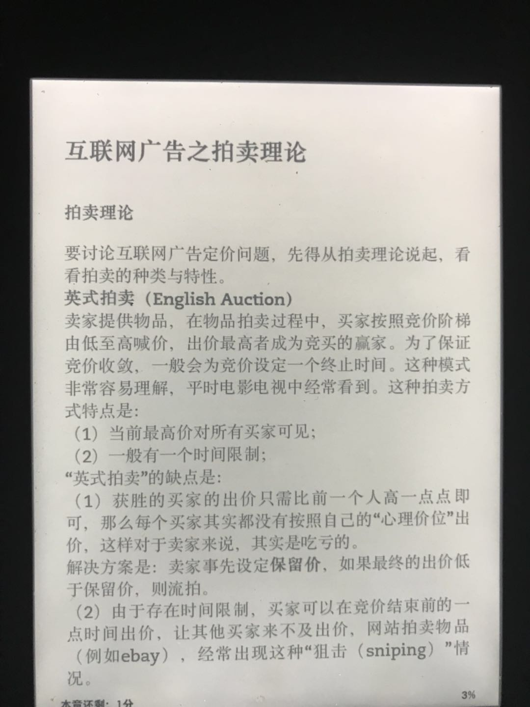

# 公众号文章抓取&生成kindle电子书

抓取公众号历史文章，解析成markdown文件，生成gitbook项目，最后可生成kindle书籍。

**PS**：
1. 需要ebook-convert依赖
2. gitbook需要在node 6.x版本，8.x不能用，其他没测试
3. 生成mobi需要配置下`book.json`

## 抓取方式

支持两种抓取方式：
1. 从公众号的一篇汇总文章开始，有些公众号会有年度总结文章，比如 [这篇文章](https://mp.weixin.qq.com/s/CIPosICgva9haqstMDIHag)
2. 使用anyproxy做代理，抓取公众号历史消息文章，忽略非图文类、小标题类文章

**PS**：汇总文章指的是一个公众号的文章页面，比如「架构师之路」的 [这篇文章](https://mp.weixin.qq.com/s/CIPosICgva9haqstMDIHag)

## 流程介绍

1. 抓取文章
2. 解析文章内链的外链「公众号文章」
3. 继续抓取外链文章
4. 替换外链文章到本地相对地址
4. 抓取文章内的图片
5. 替换文章图片到本地相对地址
6. 生成gitbook项目
7. 使用gitbook+ebook-convert生成kindle文件

1~6步是全自动的，7是看自己情况
## 安装

```bash
npm i mpspider -g
```

### 执行方式

```bash
# 第一种方式
mpspider article https://mp.weixin.qq.com/s/CIPosICgva9haqstMDIHag -d dest_path
# 第二种方式，需要手动配置代理，点击公众号「查看历史文章」，详见下面介绍
mpspider proxy -d dest_path -p proxy_port
```
抓取后，会在`dest_path`创建gitbook项目

### 生成电子书

执行命令

```bash
# 进入抓取后gitbook的地址
cd dest_path
# 创建readme.md，gitbook不创建会报错
touch README.md
# 有必要可以创建book.json，参考gitbook文档
gitbook serve
# 访问地址查看效果
# -------
# 生成电子书
gitbook mobi ./ name.mobi

```

## 如何配置anyproxy代理抓取https页面

### 配置anyproxy https证书
参考：http://anyproxy.io/cn/#%E8%AF%81%E4%B9%A6%E9%85%8D%E7%BD%AE


### 启动anyproxy
```bash
anyproxy --rule lib/anyproxyRule.js
```


## 二次开发

git clone源码后，进入文件夹，执行`npm i`

* index.js 入口文件，使用`commander`和`ora`进行命令处理
* getList.js 根据汇总文件提取文章列表
* proxySpider.js 根据anyproxy代理方式抓取
* dealMPList.js 根据代理抓取使用的文件
* unfetchMids.js 提取文章列表中内链的文章
* getImages.js 抓取文章中的图片地址，并且替换为本地地址
* createBook.js 生成gitbook markdown文件和`summary.md`，替换内链的文内容

## 电子书依赖

* ebook-convert：`brew install caskroom/cask/calibre`
* gitbook：`npm i gitbook-cli -g`


## kindle效果截图








